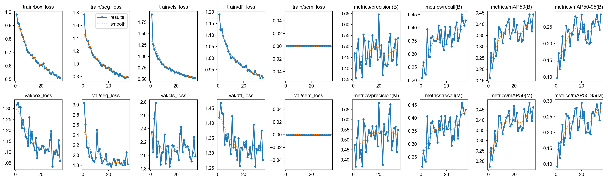
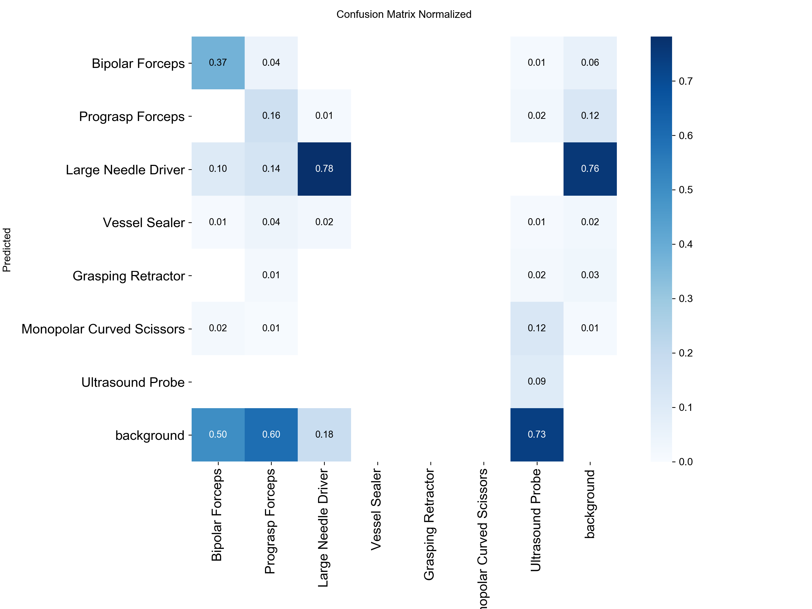
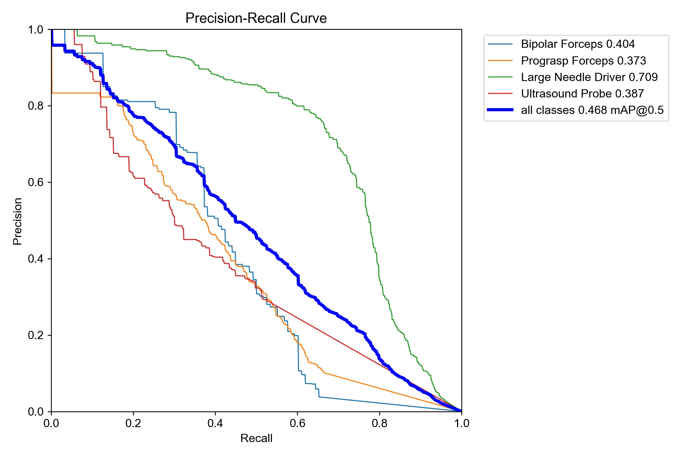

# Surgical Instrument Detection & Tracking with ROS2

End-to-end pipeline for surgical instrument instance segmentation and real-time tracking, built for minimally invasive surgery (MIS) applications. Fine-tunes YOLO11s-seg on EndoVis 2017, integrates ByteTrack for persistent instrument tracking, and deploys as a ROS2 Humble node compatible with the da Vinci Research Kit (dVRK).


---

## Demo


> Real-time inference + ByteTrack tracking on EndoVis 2017 Sequence 2. Each instrument receives a persistent track ID across frames.

---

## Overview

This project builds a complete perception pipeline for surgical robotics:

1. **Annotation conversion** — EndoVis 2017 semantic masks → YOLO instance segmentation format via contour extraction
2. **Model training** — YOLO11s-seg fine-tuned on 7 surgical instrument classes
3. **Tracking** — ByteTrack integration for persistent instrument IDs across frames
4. **ROS2 deployment** — real-time node publishing to standard topics, directly compatible with dVRK

---

## Pipeline

```
EndoVis 2017 semantic masks (PNG)
         │
         ▼
 convert_to_yolo.py     contour extraction → YOLO instance polygon .txt
         │
         ▼
 train.py               YOLO11s-seg fine-tuning (AdamW, early stopping)
         │
         ▼
 inference_video.py     YOLO11s-seg + ByteTrack → demo .mp4
         │
         ▼
 ROS2 detector_node.py
   sub  /camera/image_raw          sensor_msgs/Image
   pub  /surgical/detections       vision_msgs/Detection2DArray
   pub  /surgical/annotated_image  sensor_msgs/Image
```

---

## Results

Evaluated on EndoVis 2017 Fold 0 validation split (450 frames).
Only 4 of 7 classes appear in this split — see [Limitations](#limitations).

### Box Detection

| Class | Precision | Recall | mAP50 | mAP50-95 | Val Instances |
|---|---|---|---|---|---|
| **Mean** | **0.644** | **0.336** | **0.422** | **0.287** | **1,087** |
| Large Needle Driver | 0.537 | 0.739 | 0.684 | 0.543 | 448 |
| Bipolar Forceps | 0.426 | 0.373 | 0.316 | 0.230 | 75 |
| Prograsp Forceps | 0.714 | 0.149 | 0.329 | 0.168 | 340 |
| Ultrasound Probe | 0.899 | 0.085 | 0.361 | 0.206 | 224 |

### Mask Segmentation

| Class | Precision | Recall | mAP50 | mAP50-95 | Val Instances |
|---|---|---|---|---|---|
| **Mean** | **0.683** | **0.357** | **0.468** | **0.294** | **1,087** |
| Large Needle Driver | 0.562 | 0.765 | 0.709 | 0.569 | 448 |
| Bipolar Forceps | 0.475 | 0.415 | 0.404 | 0.231 | 75 |
| Prograsp Forceps | 0.799 | 0.166 | 0.373 | 0.170 | 340 |
| Ultrasound Probe | 0.899 | 0.084 | 0.387 | 0.205 | 224 |

**Runtime:** ~6 Hz on NVIDIA RTX 500 Ada Laptop GPU (4 GB VRAM)

### Key Insights

**Large Needle Driver performs best (Mask mAP50 = 0.709)**
Most represented class in training (1,351 instances). High recall (0.765) means the model rarely misses it — important for safety-critical surgical assistance.

**High precision, low recall across all classes**
Mean precision (0.683) is roughly 2× mean recall (0.357). The model is conservative — only predicts when confident. For surgical robotics, this tradeoff is acceptable: false positives in downstream control are more dangerous than missed detections.

**Ultrasound Probe: P=0.899, R=0.084**
Near-perfect precision but near-zero recall. Classic symptom of class underrepresentation (244 training instances) — the model learned a very tight decision boundary.

**3 classes not evaluated**
Vessel Sealer, Grasping Retractor, and Monopolar Curved Scissors have zero instances in the Fold 0 validation split. Full 4-fold cross-validation is needed for complete coverage.

---

## Training Curves

Training ran for up to 50 epochs on EndoVis 2017 Fold 0 (1,350 frames). Early stopping triggered at **epoch 20** (patience=15) — best checkpoint saved at that point.



**What the curves show:**
- `box_loss`, `seg_loss`, `cls_loss` all decrease steadily — model learning bounding box regression, mask quality, and classification simultaneously
- Validation mAP improves until ~epoch 20 then plateaus — consistent with where early stopping triggered
- Precision climbs faster than recall — model becomes increasingly conservative, only predicting when confident

| Confusion Matrix (Normalized) | Mask Precision-Recall Curve |
|---|---|
|  |  |

---

## Project Structure

```
├── scripts/
│   ├── convert_to_yolo.py      # Convert semantic masks → YOLO instance format
│   ├── verify_labels.py        # Visual verification of converted labels
│   ├── train.py                # YOLO11s-seg training
│   └── inference_video.py      # Inference + ByteTrack demo video
├── src/
│   └── dataset.py              # Dataset loader + visualization utilities
├── ros2_ws/
│   └── src/surgical_instrument_detector/
│       ├── detector_node.py    # ROS2 node — inference + tracking + publish
│       ├── test_publisher.py   # Simulated camera using EndoVis frames
│       ├── setup.py
│       └── package.xml
└── assets/                     # Training result plots
    ├── results.png
    ├── confusion_matrix_normalized.png
    └── MaskPR_curve.png
```

---

## Quickstart

### 1. Clone and install

```bash
git clone https://github.com/AlvinOctaH/surgical-instrument-detection-ros2.git
cd surgical-instrument-detection-ros2

conda create -n surgical_cv python=3.10 -y
conda activate surgical_cv
pip install torch torchvision --index-url https://download.pytorch.org/whl/cu121
pip install ultralytics opencv-python numpy matplotlib pandas tqdm PyYAML
```

### 2. Dataset

Download EndoVis 2017 via [MATIS](https://github.com/BCV-Uniandes/MATIS) and extract to:

```
data/MATIS/endovis_2017/
├── images/               # 1800 PNG frames (1280×1024)
└── annotations/
    ├── images/           # 1800 semantic mask PNGs
    └── Fold0/
        ├── train.json
        └── val.json
```

### 3. Convert annotations

```bash
python scripts/convert_to_yolo.py
```

Converts semantic segmentation masks → YOLO instance segmentation format. Output saved to `data/yolo_dataset/`.

### 4. Verify labels

```bash
python scripts/verify_labels.py
```

Saves polygon overlay images to `results/predictions/` for visual inspection.

### 5. Train

```bash
python scripts/train.py
```

Fine-tunes YOLO11s-seg. Best weights saved to `results/endovis_yolo11s_seg_v1/weights/best.pt`.

### 6. Demo video

```bash
python scripts/inference_video.py
```

Runs YOLO11s-seg + ByteTrack on seq2. Output: `results/demo_tracking.mp4`

---

## ROS2 Integration

Tested on Ubuntu 22.04 + ROS2 Humble (WSL2 compatible).

### Install dependencies

```bash
sudo apt install -y ros-humble-vision-msgs ros-humble-cv-bridge ros-humble-rqt-image-view
pip3 install ultralytics
```

### Build

```bash
cd ros2_ws
colcon build --packages-select surgical_instrument_detector
source install/setup.bash
```

### Run

```bash
# Terminal 1 — detector node
ros2 run surgical_instrument_detector detector_node

# Terminal 2 — simulated camera (replays EndoVis frames)
ros2 run surgical_instrument_detector test_publisher

# Terminal 3 — visualize live output
ros2 run rqt_image_view rqt_image_view
# select /surgical/annotated_image in the dropdown
```

### Topics

| Topic | Message Type | Description |
|---|---|---|
| `/camera/image_raw` | `sensor_msgs/Image` | Input — subscribe |
| `/surgical/detections` | `vision_msgs/Detection2DArray` | Per-instance detections + track IDs |
| `/surgical/annotated_image` | `sensor_msgs/Image` | Visualization frames |

### Node Parameters

```bash
ros2 run surgical_instrument_detector detector_node \
  --ros-args \
  -p weights_path:=/path/to/best.pt \
  -p conf_threshold:=0.25 \
  -p iou_threshold:=0.45 \
  -p img_size:=640
```

---

## Training Details

| Config | Value |
|---|---|
| Model | YOLO11s-seg (COCO pretrained) |
| Dataset | EndoVis 2017, Fold 0 |
| Train / Val split | 1,350 / 450 frames |
| Epochs | 50 (early stop at epoch 20) |
| Optimizer | AdamW (lr=0.001, lrf=0.01) |
| Batch size | 8 |
| Image size | 640 × 640 |
| Augmentation | HFlip, HSV jitter, rotation ±10°, mosaic |
| Hardware | NVIDIA RTX 500 Ada, 4 GB VRAM |
| Training time | ~3 hours |

---

## Limitations

- **Single-fold evaluation** — Fold 0 val split contains only 4 of 7 classes. Full 4-fold cross-validation needed for complete per-class coverage.
- **Throughput** — ~6 Hz on mobile GPU. TensorRT deployment expected to reach real-time (>25 Hz).
- **Instance merging** — same-class instruments in contact are merged into one polygon. Learned instance separation would handle this better.
- **Early stopping** — best checkpoint at epoch 20 out of 50. Longer training with learning rate scheduling may improve rare class performance.

---

## References

- [EndoVis 2017](https://endovissub2017-roboticinstrumentsegmentation.grand-challenge.org/) — MICCAI 2017 Robotic Instrument Segmentation Challenge
- [Ultralytics YOLO11](https://github.com/ultralytics/ultralytics)
- [ByteTrack](https://arxiv.org/abs/2110.06864) — Zhang et al., ECCV 2022
- [MATIS](https://github.com/BCV-Uniandes/MATIS) — Dataset bundle
- [dVRK](https://github.com/jhu-dvrk/sawIntuitiveResearchKit) — da Vinci Research Kit

---

## Author

**Alvin Octa Hidayathullah**
B.Eng. Robotics & AI Engineering, Universitas Airlangga

[](https://github.com/AlvinOctaH)

---

## License

This project is licensed under the MIT License — see [LICENSE](LICENSE) for details.
